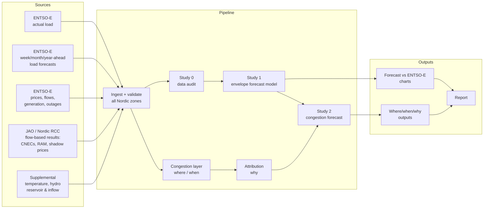

# Baseload — Project Map

**Status as of 2026-09-11.** This document is the source of truth for what Baseload is, what it asks, and how the repository gets there. It replaces the earlier BESS-startup framing (see [Decisions log](#9-decisions-log)).

---

## 1. What Baseload is

A solo portfolio research project that asks whether **public** Nordic grid data can forecast load extremes and congestion better than the official forecasts published on ENTSO-E — and explain *where, when and why* congestion happens.

- **Deliverables:** a clean, reproducible portfolio repo and a written report.
- **Headline output:** charts of Baseload's forecast versus ENTSO-E's forecast against actuals, plus where/when/why congestion analysis.
- **Scope:** all Nordic flow-based bidding zones — NO1–NO5, SE1–SE4, FI, DK1, DK2.
- **No deadline.** Phases below are ordered, not scheduled.

### What it is not

- Not a BESS valuation or revenue tool (removed — see §7).
- Not a commercial product or a competitor to Volue, Modo, Aurora etc.
- Not a day-ahead hourly price or load forecaster (the space where commercial players with private data compete).

---

## 2. Where it started

ENTSO-E's Transparency Platform publishes TSO load forecasts as **min/max envelopes** at several horizons. Comparing them with actual load for NO1 (screenshots, 2026-09-11) showed actuals repeatedly landing on or outside the forecast band:

| Forecast | Resolution | What the actuals do (NO1, read off the charts) |
|---|---|---|
| Year-ahead, weeks 1–36 of 2026 | weekly min/max | Jan–Feb actual max ~500–1000 MW above forecast max; spring actual min ~300–500 MW below forecast min; summer max at/above the upper edge |
| Month-ahead, weeks 49–51 of 2025 | weekly min/max | Max inside band; min ~200–300 MW below forecast min every week |
| Week-ahead, 1–7 Dec 2025 | daily min/max | Max inside band; min ~400–1250 MW below forecast min every day |

Two readings of this, which Study 0 must separate:

1. **The forecast band is too narrow** — real load swings further than TSOs forecast, especially downward. A genuine, correctable forecasting bias.
2. **Part of the gap is an artefact.** Red flag: for the same week in December, the *week-ahead* forecast missed the minimum by more than the *month-ahead* one. Shorter horizons should be better, not worse.

---

## 3. Research questions

The project is a chain of studies. Each is finishable and publishable on its own; each feeds the next.

### Study 0 — Is the gap real? (data audit)

> Are the misses between ENTSO-E load forecast envelopes and actual load real forecasting errors, or artefacts of how the data is defined, sampled or published?

Candidate artefacts to rule in or out:
- **Resolution mismatch** — actuals at 15-min MTU (since 1 Oct 2025) vs forecasts built on hourly or averaged values; min/max of 15-min data is more extreme by construction.
- **Definition mismatch** — forecast and actual "total load" including/excluding different things (pumping, losses, self-supply).
- **Revisions** — the platform may show the latest submitted forecast, not the one that existed at the stated horizon.
- **Data quality** — gaps, spikes, or zeros in actual load pulling the minimum down.

**Done when:** for every zone and horizon, the gap is decomposed into "explained by artefact X" and "remaining genuine error", with evidence. Either outcome is a finding.

### Study 1 — Can public data correct the forecasts?

> Are ENTSO-E's week-, month- and year-ahead load envelope forecasts systematically biased, and can a model built only on public data produce better-calibrated min/max envelopes?

- **Targets:** daily min/max (week-ahead horizon), weekly min/max (month- and year-ahead horizons), per zone.
- **Benchmarks:** the ENTSO-E forecast itself, plus naive baselines (same period last year; climatology).
- **Metrics:** signed bias of min and max; MAE; **band coverage** (share of periods where actuals fall outside the band); interval score.
- **Candidate inputs:** historical actual load, calendar and holidays, temperature (climatology for long horizons, weather forecasts for week-ahead), the ENTSO-E forecast itself as a feature to correct.
- **Evaluation:** strictly out-of-sample, rolling origin, forecasts only using information available at the horizon.

**Done when:** out-of-sample results per zone × horizon show whether Baseload beats ENTSO-E and the baselines, and the forecast-vs-ENTSO-E chart (§5) is produced for every zone.

### Study 2 — Where, when and why does congestion occur?

> Does congestion in the Nordic flow-based market accumulate systematically — and can corrected load envelopes help forecast where, when and why it happens, at the same horizons as Study 1?

Three layers, in order of difficulty:

1. **Where / when (descriptive).** Which network elements and zone borders bind, how often, in what runs (persistence), in which seasons, and whether binding events cluster across the network. This answers the original "does congestion accumulate systematically?" question.
2. **Why (attribution).** Link each binding event to system conditions: load extremes, temperature, hydro reservoir and inflow, wind, outages. Flow-based data makes this tractable because the binding element is *published* rather than inferred from price spreads.
3. **Forecast.** Probability that a zone pair separates / a given element binds on a day (week-ahead) or in a week (month- and year-ahead).

**Core hypothesis (H2):** periods where actual load breaks out of the ENTSO-E forecast band are over-represented in congestion events, so Study 1's corrected envelopes improve congestion forecasts over using the ENTSO-E forecast.

**Done when:** where/when/why outputs exist for all zones, and H2 is tested out-of-sample.

---

## 4. Key domain constraint: the market is flow-based

Since late October 2024 the Nordic day-ahead market clears with **flow-based market coupling**. There is no single transfer capacity per border any more. Instead:

- The market checks hundreds of **critical network elements under contingencies** (CNECs) — specific lines and transformers under "what if X trips" scenarios.
- Each has **remaining available margin** (RAM) and **PTDFs** — sensitivities describing how much a trade between zones loads that element.
- When an element's margin is exhausted it gets a **shadow price**, and zone prices separate — sometimes even when no border looks "full".
- These results are published (Nordic RCC via JAO's publication tool).

Consequences for Baseload:
- Congestion is modelled on **published flow-based results**, not on NTC "pipe" limits.
- The existing NTC-based code (`congestion_model.py`, `calibrate_ntc.py`, `norway_network.py`) describes the pre-October-2024 market design.
- Zonal price spreads remain useful as a simple, long-history entry layer.
- Flow-based history starts late October 2024 (~2 years), which limits year-ahead evaluation in Study 2.

---

## 5. Outputs

### Forecast-vs-ENTSO-E chart (per zone × horizon)

- ENTSO-E forecast min–max band (shaded, as on the Transparency Platform)
- Baseload forecast min–max band (second band or outline)
- Actual min and actual max (lines)
- Lower panel: error of each forecast's min and max vs actual, over time
- Summary annotation: coverage and bias for both forecasts over the evaluation window

### Congestion outputs

- **Where:** ranking of binding elements / borders by frequency and total shadow price, mapped to zones
- **When:** calendar and persistence views (runs, seasonality, co-occurrence across elements)
- **Why:** attribution table per binding event (conditions present) and aggregate cause breakdown
- **Forecast:** predicted vs observed binding probability, with the corrected-envelope vs ENTSO-E-envelope comparison for H2

### Report outline

1. Introduction and motivation (the NO1 observation)
2. Data and the Nordic market design (flow-based, 15-min MTU)
3. Study 0 — data audit
4. Study 1 — load envelope forecasting
5. Study 2 — congestion where/when/why and H2
6. Limitations, and what private data would change
7. Reproducibility appendix

---

## 6. System map

### What exists today vs. what the map needs

| Stage | Existing code | Gap |
|---|---|---|
| Ingest | `fetch_entsoe_api.py` (API, NO zones), `ingest_entsoe.py` (GUI CSVs), `ingest_supplemental.py` (hydro) | Load **forecasts are not ingested** (`ingest_entsoe.py` drops the forecast column); no SE/FI/DK; no flow-based data; temperature source undecided |
| Validate | `validate_data.py`, `baseload/` (io, schemas, validators, zones) | Schemas for forecasts and flow-based tables |
| Study 0 | — | Everything |
| Study 1 | `price_forecast.py` has quantile-forecast + back-test machinery that may be repurposable | Load envelope model, baselines, evaluation, chart |
| Congestion where/when | `spreads_congestion.py`, `market_metrics.py` (zonal) | Flow-based CNEC layer |
| Why | Attribution logic in `congestion_model.py`; `regime_clustering.py` (system-state features) | Rebuild on flow-based binding events |
| Report | `alerts_and_memo.py` (BESS-oriented memo) | Rework into a report generator |

---

## 7. Repository transition

### Remove (BESS valuation — retired)

- `bess_valuation_pf.py`, `bess_valuation_rh.py`, `bess_valuation_pypsa.py`, `revenue_percentiles.py`
- `ingest_reserves.py` (reserve markets only mattered for the BESS revenue stack)
- Tests for the above: `tests/test_bess_valuation_pf.py`, `tests/test_bess_valuation_rh.py`, `tests/test_revenue_percentiles.py`, `tests/test_ingest_reserves.py`
- `docs/p50_p90_methodology.md`
- BESS schemas/readers in `baseload/schemas.py` and `baseload/io.py`; `bess`, `rolling`, `p50p90` config blocks
- BESS artifacts (`artifacts/tables/valuation_*`, `artifacts/figures/valuation_*`)
- `web/` (the Next.js product landing page)
- GitHub: close issues #22 and #23 and PR #25

### Archive to `docs/archive/`

- `docs/strategic_review_2026-04-19.md`
- `docs/meeting_ensemble_regime_detection.md`
- `artifacts/memo/memo.md`, `artifacts/reports/*`, `artifacts/figures/thoughts.txt`

### Rework

- `fetch_entsoe_api.py` / `ingest_entsoe.py` → one API-based ingest for all Nordic zones, including load forecasts at every horizon
- `congestion_model.py` → flow-based congestion layer, keeping the attribution idea
- `alerts_and_memo.py` → report/figure generator
- `configs/` → Nordic zones, forecast horizons, flow-based settings; drop NTC blocks

### Keep

- `baseload/` package, `validate_data.py`, `market_metrics.py`, `spreads_congestion.py`, `ingest_supplemental.py`
- `Papers/` (references)

### Decide later

- `calibrate_ntc.py`, `norway_network.py` — NTC/transport models of the old market design; remove unless a use appears
- `price_forecast.py` — repurpose for Study 1 or remove
- `regime_clustering.py` + `docs/regime_validation.md` — keep only if system-state regimes help the "why" layer
- `no1_only_up.csv` (root) — origin unclear
- Stale branches and the `.claude/worktrees/` checkout

---

## 8. Roadmap

Ordered phases; no dates.

| # | Phase | Done when |
|---|---|---|
| 0 | **Retire the old frame** — execute §7 removals and archive | Repo contains no BESS code, tests pass, README matches this map |
| 1 | **Load data foundation** — ingest actual load + week/month/year-ahead forecasts for all Nordic zones via the API, with provenance | Every zone × horizon available as validated parquet for the full available history |
| 2 | **Study 0** — reproduce the NO1 screenshots for all zones, then test each artefact hypothesis | Audit write-up + coverage/bias tables; first report chapter |
| 3 | **Study 1** — envelope model, baselines, rolling out-of-sample evaluation | Forecast-vs-ENTSO-E charts for all zones; results chapter |
| 4 | **Congestion data foundation** — ingest flow-based results; map CNECs to zones and locations | Binding events table with element, zone mapping, shadow price, RAM |
| 5 | **Study 2** — where/when → why → forecast; test H2 | Where/when/why outputs + H2 result; results chapter |
| 6 | **Portfolio polish** — report, README walkthrough, reproducible one-command run | A stranger can clone, run, and read the story |

---

## 9. Decisions log

| Date | Decision | Why |
|---|---|---|
| 2026-04-19 | (Superseded) Pursue BESS project-finance positioning | Strategic review; see `docs/archive/` |
| 2026-09-11 | Baseload is a portfolio/learning research project; outputs are a repo + report | Can't compete with commercial energy analytics firms; the research question is the value |
| 2026-09-11 | Remove BESS valuation entirely | Not part of the research story |
| 2026-09-11 | Spine = Study 0 → Study 1 (load envelopes) → Study 2 (congestion) | Connects the original NO1 observation to the congestion question |
| 2026-09-11 | Model congestion on flow-based data, not NTC | Nordic market is flow-based since Oct 2024; published binding elements make the "why" tractable |
| 2026-09-11 | Study 2 uses the same horizons as Study 1 (days to a year ahead) | Lets corrected envelopes feed congestion forecasts; avoids the crowded day-ahead hourly space |
| 2026-09-11 | Scope = all Nordic flow-based zones (NO1–5, SE1–4, FI, DK1–2) | Matches the flow-based region so congestion data lines up |
| 2026-09-11 | Remove `web/`, rewrite README, archive old strategy docs | Retire the startup frame |

---

## 10. Open questions and risks

- **Forecast history and revisions.** How far back do ENTSO-E envelope forecasts go per zone, and can the as-of-horizon version be recovered, or only the latest revision?
- **Temperature source.** Which public source for historical temperature and week-ahead weather forecasts across all Nordic zones?
- **Flow-based history is short** (~2 years) — year-ahead congestion forecasts may be evaluable only descriptively.
- **CNEC identity.** Element names are TSO codes; mapping them to physical locations and zones may need manual work, and the CNEC set changes over time.
- **Study 0 could dissolve Study 1.** If the gap is mostly artefact, Study 1 becomes "what's the true error once artefacts are removed" — still valid, but smaller.
- **DK1** is coupled to the continent, not only the Nordic flow-based region — check what that means for its congestion data.
